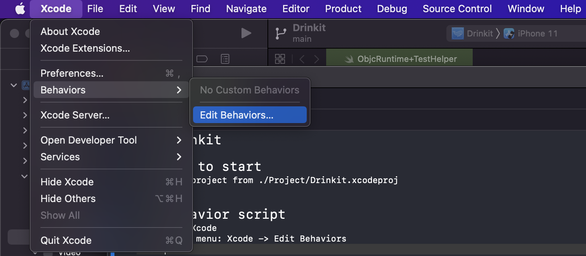

# Behavior script

1. open Xcode
2. go to menu: `Xcode` -> `Edit Behaviors`

3. Add new behavior
- Tap `+`
- Enter name of new behavior *(ex. format_and_sort)*

4. Configuration
- Add new keyboard shortcut *(ex. `Control+Option+I`)*
- Enable script phase
- Select script `<local repo path>/scripts/main.sh`

5. Sample result 👇🏼

